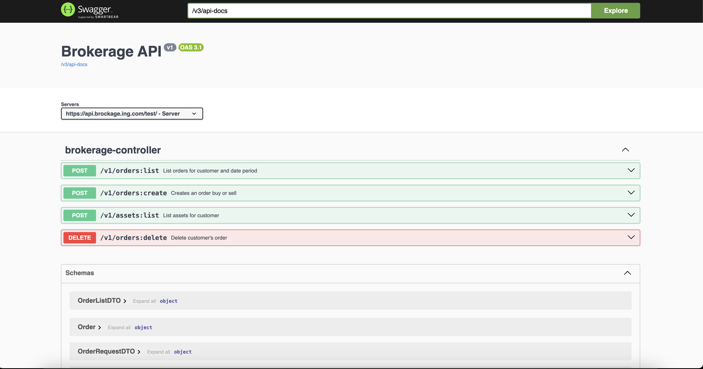

# Brokerage Firm  

## Introduction

This is case study that simulates a brokerage company provides basic services like order create(buy,sell,deposit,withdraw),list,delete(cancel) and asset listing.
It is working on H2 database and starts with running sql located in resources directory. (init.sql)

Access to h2 database and password is located application.yaml.
```
http://localhost:8080/h2-console
```


Swagger documentation is available for test environment via this url.

```
http://localhost:8080/v3/swagger-ui/index.html
```



## Postman Test payloads

### Deposit TRY

```
curl --location 'http://localhost:8080/v1/orders:create' \
--header 'Content-Type: application/json' \
--header 'Cookie: JSESSIONID=0549F4F65494E5DAF5D33F903E3ADB9E' \
--data '{
"customerId": 1,
"assetName": "TRY",
"side": "BUY",
"price": 5000,
"size": 1
}'
```

### SELL ORDER

```
curl --location 'http://localhost:8080/v1/orders:create' \
--header 'Content-Type: application/json' \
--header 'Cookie: JSESSIONID=0549F4F65494E5DAF5D33F903E3ADB9E' \
--data '{
"customerId": 2,
"assetName": "BTC",
"side": "SELL",
"price": 100,
"size": 30
}'
```

### BUY ORDER

```
curl --location 'http://localhost:8080/v1/orders:create' \
--header 'Content-Type: application/json' \
--header 'Cookie: JSESSIONID=E02949B588E5A4C6C302DC4EE3F76F91' \
--data '{
"customerId": 1,
"assetName": "BTC",
"side": "BUY",
"price": 100,
"size": 30
}'
```

 

### ORDER LIST

```
curl --location 'http://localhost:8080/v1/orders:list' \
--header 'Content-Type: application/json' \
--header 'Cookie: JSESSIONID=0549F4F65494E5DAF5D33F903E3ADB9E' \
--data '{
    "customerId": 1,
    "startDate":"2025-02-11 00:00:00",
    "endDate" : "2025-02-24 00:00:00"
}'
```

### CANCEL ORDER

```
curl --location --request DELETE 'http://localhost:8080/v1/orders:delete' \
--header 'Content-Type: application/json' \
--header 'Cookie: JSESSIONID=0549F4F65494E5DAF5D33F903E3ADB9E' \
--data '{
"orderId" : 1
}'
```